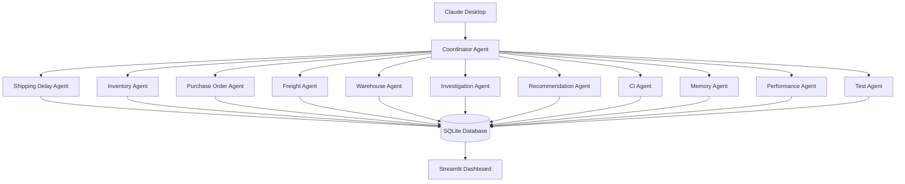

# 🏭 Supply Chain Control Tower


A public demo/community edition of a local multi-agent AI system for supply chain intelligence —
built with Python, FastMCP, SQLite, and Claude Desktop.

---

## What Is This?

The Supply Chain Control Tower is a public demo/community edition of a multi-agent AI system designed to explore how agentic AI can support supply chain operations.

It connects multiple specialized MCP agents to Claude Desktop, allowing users to ask supply chain questions in plain English and receive structured, business-focused answers.

The project demonstrates how AI agents can work together across supply chain domains such as shipment delays, inventory, purchasing, freight, warehouse operations, investigation, recommendations, testing, performance monitoring, and coordination.

This repository is intended for learning, portfolio, open technical contribution, and architecture demonstration purposes.

---

## Why This Project Matters

Modern supply chain teams often work across disconnected systems, manual spreadsheets, delayed reports, and siloed operational data.

This project demonstrates a practical approach to using multi-agent AI for:

- Operational visibility
- Root-cause analysis
- Exception management
- Recommendation support
- Performance monitoring
- Continuous-improvement workflows
- Human-readable supply chain intelligence

The goal is to show how AI can move beyond chat-based assistance and become part of real operational decision-support workflows.

---

## Technical Contribution

This project contributes a working reference architecture for applying MCP-based multi-agent AI to supply chain operations.

It demonstrates:

- Multi-agent orchestration using MCP and FastMCP
- Local AI workflow with Claude Desktop
- Domain-specific supply chain agents
- SQLite-based operational data layer
- Centralized configuration
- Streamlit dashboard for visibility
- Security-aware tool execution
- Performance monitoring and caching
- Token usage tracking
- Automated testing across agent workflows
- Optional LLM fallback support
- Continuous-improvement style recommendation refinement

This public version is intentionally limited to a demo/community scope while preserving the architecture and implementation patterns needed to understand the approach.

---

## Example Questions You Can Ask Claude

```
"What orders need action today?"
"Investigate SO10003 — why is it delayed?"
"Which carriers are underperforming?"
"What is the recommended action for SO10001?"
"Run the daily risk report."
"Are there any stockouts I should know about?"
"What does today's supply chain look like?"
"Which warehouse picks are falling behind?"
```

---

## High-Level Architecture



The coordinator routes user questions to the relevant agents.
Specialized agents retrieve required data, apply configurable business rules, and return structured results to Claude.

---

## Agent Coverage

| Agent | Domain |
|---|---|
| shipping-delay-agent | Shipment delay analysis |
| inventory-agent | Inventory monitoring |
| po-agent | Purchase order tracking |
| freight-agent | Freight and carrier performance |
| warehouse-agent | Warehouse operations |
| investigation-agent | Root-cause investigation |
| recommendation-agent | Action prioritization |
| ci-agent | Continuous-improvement insights |
| memory-agent | Cross-session memory |
| performance-agent | Performance monitoring |
| coordinator-agent | Coordination and routing |
| test-agent | Automated testing |

**Total: 12 agents — 57 tools**

---

## Key Features

### Multi-Agent Reasoning

Claude can work across multiple supply chain agents to answer complex operational questions.

For example, a single investigation request may involve shipment status, inventory availability, warehouse progress, and freight/carrier information.

### Supply Chain Intelligence

The system applies configurable supply chain rules for:

- Delay classification
- Inventory risk
- Carrier performance
- Warehouse status
- Action prioritization
- Management reporting

Rules are centralized so the logic can be adjusted for different operating models.

### Continuous Improvement Layer

The project includes an experimental continuous-improvement layer that detects recurring supply chain patterns and supports feedback-based recommendation refinement.

### Security-Aware Execution

The system includes safeguards such as:

- Read-only database access
- Input validation
- SQL execution controls
- Prompt-injection protection
- Tool-call audit logging

### Performance Layer

The project includes platform utilities for:

- Query caching
- Token usage tracking
- Slow-query detection
- Performance logging
- Anomaly detection

### Optional LLM Fallback

Optional fallback support is included for continuity when the primary assistant is unavailable or rate-limited.

### Central Configuration

Core settings are managed through a centralized configuration file, making the system easier to maintain and extend.

### Automated Testing

The project includes automated test scenarios across the agent ecosystem to validate key workflows and expected outputs.

---

## Tech Stack

| Component | Technology |
|---|---|
| Language | Python 3.10 |
| AI Protocol | MCP via FastMCP |
| AI Client | Claude Desktop |
| Optional Fallback | OpenRouter |
| Database | SQLite |
| Dashboard | Streamlit + Plotly |
| Configuration | PyYAML |
| OS Tested | Windows |

---

## Project Structure

```
supply_chain_mcp_project/
│
├── config/        # Centralized settings and public example configuration
├── data/          # SQLite database and sample data
├── docs/          # Installation and upgrade documentation
├── logs/          # Runtime logs and audit outputs
├── mcp_server/    # MCP agent servers
├── scripts/       # Setup and utility scripts
├── src/           # Shared business logic and platform utilities
├── tests/         # Automated test scenarios
├── dashboard/     # Streamlit dashboard
│
├── .gitignore
├── CLAUDE.md
├── requirements.txt
└── README.md
```

---

## Quick Start

### Prerequisites

- Python 3.10
- Claude Desktop
- Git

### Installation
```bash
# Clone the repository
git clone https://github.com/vishal2559/supply-chain-control-tower.git
cd supply-chain-control-tower

# Install dependencies
pip install -r requirements.txt

# Set up the database
python scripts/csv_to_sqlite.py
python scripts/build_indexes.py
```

For Claude Desktop setup, see: `docs/INSTALLATION_GUIDE.md`

---

### Configuration

This repository includes a public-safe example configuration:

```bash
cp config/settings.example.yaml config/settings.yaml

## Optional Fallback Setup

```bash
# Create .env file at project root
echo OPENROUTER_API_KEY=your-key-here > .env

# Check fallback configuration
python scripts/check_balance.py

# Start fallback chat
python scripts/fallback_chat.py
```

> Do not commit `.env` files or API keys to GitHub.

---

## Slash Commands

| Command | Description |
|---|---|
| `/sc-briefing` | Daily supply chain summary |
| `/sc-investigate` | Root-cause analysis for a specific order |
| `/sc-escalate` | Orders needing immediate action |
| `/sc-scan` | Improvement scan |
| `/sc-weekly` | Weekly performance report |

---

## Version History

| Version | What Was Added |
|---|---|
| v1.0 | Initial shipment delay and inventory agents |
| v1.5 | Purchase order, freight, and warehouse coverage |
| v2.0 | Investigation, recommendation, and improvement capabilities |
| v2.5 | SQLite upgrade and Streamlit dashboard |
| v3.0 | Standardized configuration, security layer, caching, performance monitoring, coordinator, testing, and optional fallback support |

---

## Roadmap

- **Phase 2 — Deployment Ready:** Containerized setup and easier local deployment.
- **Phase 3 — Production Ready:** Cloud-ready patterns, CI/CD, monitoring, and performance optimization.
- **Phase 4 — Enterprise Ready:** Tenant-aware architecture, integration readiness, security hardening, and governance.

---

## Public Demo Scope

This repository is intended for learning, portfolio, open technical contribution, and architecture demonstration purposes.

It demonstrates the architecture, agent collaboration pattern, and supply chain use case using sample data and configurable rules.

Additional research and architecture experiments are maintained separately from this public demo version.

---

## Author

**Vishal Vishwakarma** — AI Engineer | Supply Chain AI | Multi-Agent Systems

GitHub: [github.com/vishal2559](https://github.com/vishal2559)

---

## License

MIT License — see [LICENSE](LICENSE) for details.

---

*Built as a learning project that evolved into a production-inspired reference architecture for multi-agent supply chain intelligence.*
